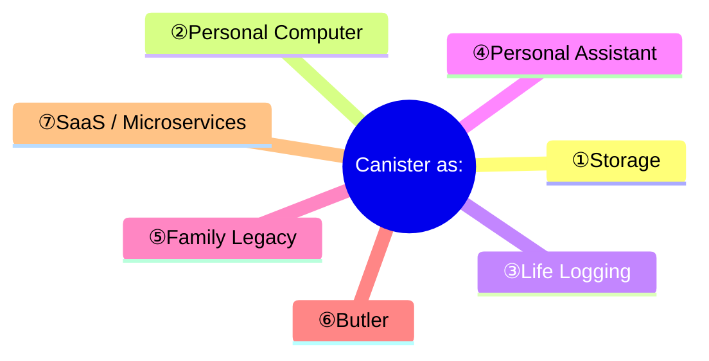
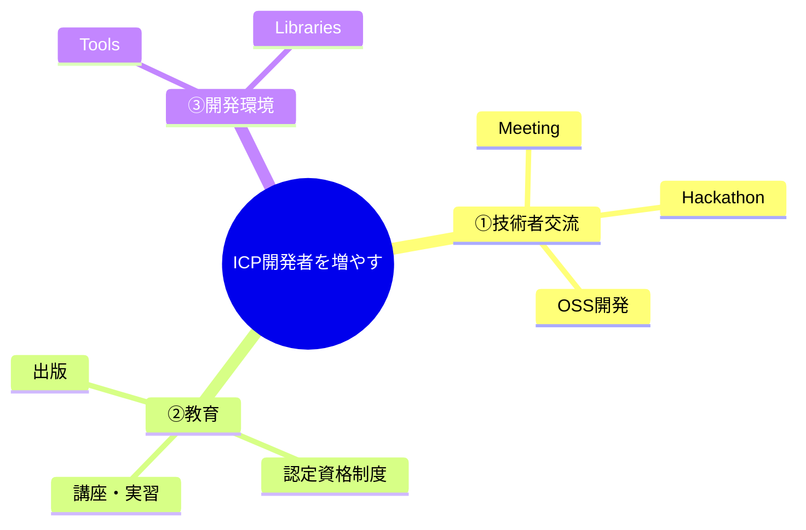

# ICP Canister Ideation

## はじめに

分散型クラウド環境であるICP (Internet Computer Protocol)上で動作するCanisterを開発して実現したいアイデアを創出する『ICP Hackathon 2025 Wave2』が2025年2月1日～2月14日（提出期限は2月10日）まで開催されています。

https://x.com/icphub_JP/status/1885341745346732452

## 1. アイデアの整理『Canister as』

まずは、『Canister as ～』という視点で掘り下げてみたいと思います。

### ①Storage

Internet Computerを分散型クラウド環境と捉えると、Canisterは『Storage』として利用することができます。

既存のAWS S3、Azure Storage、Google Cloud Storageとの大きな違いは、Wasmモジュールによりデータの管理方法やアクセスI/Fを任意に決定できるプログラマブルな点で、よりオープンな仕様を実現できる可能性があります。

単にファイルを保存するというだけではなく、利用するサービスごとにデータの形式も違いますので、こうした仕様がオープンに議論されて決定していくプロセスが必要です。

これから先、数十年、数百年という長期にわたってデータを記録・保管することを考えた場合、ベンダーロックインされず透明性が高いことは重要です。

CanisterをStorageとして利用するには、現時点では容量やコスト面で課題がありますが、これらは時間が解決する問題ともいえます。

### ②Personal Computer

Canisterを単なるStorageではなく『Personal Computer』として考えてみます。

Internetが普及する以前、多くのPersonal Computerはスタンドアローンで利用され、各アプリケーションのデータはComputer内に完結していました。

様々なWebサービスを利用している現在では、自分のデータがWebサービス側にのみ保存されていることも多く、サービスを利用しなくなったり、サービス停止によってデータにアクセス出来なくなってしまうこともよくあります。

Internet上に自分のPersonal Computerが存在し、Storageとしての機能を持っていれば、適切なデータ暗号化やアクセス制御によってデータの主権を取り戻せると考えています。

サービス側がすべての個人データを持つ必要はなく、サービス側が個人のCanisterにデータを記録していくという構造の変化は考えられます。

Google DriveやiCloudなどのクラウドストレージを利用すれば様々なデバイスからデータにアクセスできるように、様々なデバイスからデータアクセスだけでなく、コンピューティングができるようになります。

個人のInternet上の活動が自分専用のCanisterを経由して行われ、大切なデータはそのCanisterに保管されます。

### ③Life Logging

PCやクラウド上にあるファイルは、誤った操作等によってデータが消失してしまうリスクが常にあります。

大切なデータをずっと残せるようにするには、一時的に保存するだけのデータとは別に、GitやSubversion、もしくはBlockchainのように履歴が残っていく仕組みも不可欠です。

私自身、子どもが生まれてからずっと成長の記録、読書や学習の記録、また、描いた絵や文章はスキャンする等してできるかぎり記録を残してきました。

現時点ではまだどのような意味を持つのかの答えをはっきりとは見い出せていませんが、記録として残ってさえいれば、いつか何らかの価値を生むかもしれないと考えています。

様々なサービスを利用して保存したデータはできるかぎり残しておきたいものです。

現実としてデータ容量の問題はありますが、これは時間が解決してくれる問題です。

個人のデータを記録するためのCanisterには、Application subnetsのように13ノードも必要なく、データ容量があることの方が望ましいと考えます。

### ④Personal Assistant

個人のCanistern内に自分だけのAIエージェントが必要となるかもしれません。生まれてからずっと記録してきたデータ、学習サイトなどを利用した記録から、より自分に合ったアドバイスも受けられるようになるでしょう。

外部に個人情報を漏らすことなく、Canister内に完結できることがセキュリティ上重要です。

生まれたときからにCanisterをつくって記録を残していき、亡くなった後はAIエージェントが守り続けることもできるでしょう。

### ⑤Family Legacy

『100年、200年後の未来にデータを遺していきたい』と考えたときに、一人1 Canisterという単位だけではなく、家族や世帯という単位でもCanisterを用意することになるかもしれません。

先祖代々から受け継がれてきた家宝には、長い年月を経てずっと残すことができたという点だけでも十分に価値があるように、遠い未来において、この時代を記録したデジタルデータにも価値があるでしょう。

コンピュータが誕生してデジタルデータが扱われるようになってから、まだ100年も経っていません。  
そのあいだに文字コードから、文書、画像、動画など様々なデータの標準化も進み、Internetも普及して、ようやくデータを遺せる環境が整いつつあります。

### ⑥Butler

個人のCanisterにPersonal Agssistantがあるように、世代を越えてCanister内のデータを大切に守っていくAI Butler（執事）のような存在が

数百年後の未来、AI Butlerが、家族のストーリーを語る姿を想像してみてださい。
データがしっかり遺っていれば、そこから生み出される価値は計り知れません。

#### イメージ

### ⑦SaaS / Microservices

Canisterを様々なサービスを提供するSaaS Platformと考えると、まったく新しいサービスを創出するアプローチだけではなく、既存のWebサービスをCanisterとして提供することがInternet Computerの普及には欠かせません。

すでにICP上のCanisterとして、既存のサービスと同様の機能が提供されているものもあります。

|大分類|中分類|Webサービス例|ICP|
|:--|:--|:--|:---|
|ビジネス|プロジェクト管理|[Asana](https://asana.com/), [Trello](https://trello.com/), [Jira](https://www.atlassian.com/software/jira), [Backlog](https://nulab.com/backlog/)||
||CRM|[Salesforce](https://www.salesforce.com/), [HubSpot](https://www.hubspot.com/), [Zoho CRM](https://www.zoho.com/crm/)||
||Office Suite|[Google Workspace](https://workspace.google.com/), [Microsoft 365](https://www.office.com/), [Zoho Office Suite](https://www.zoho.com/officesuite/)||
||電子署名|[docusign](https://www.docusign.com/), [CLOUDSIGN](https://cloudsign.jp)||
||人事管理 (HCM) |[Workday](https://www.workday.com/), [SAP SuccessFactors](https://www.sap.com/products/hcm.html)||
|コミュニケーション|ビデオ会議|[Zoom](https://www.zoom.com/), [Google Meet](https://meet.google.com/), [Microsoft Teams](https://teams.microsoft.com/)||
||チャット|[Slack](https://slack.com/), [Microsoft Teams](https://teams.microsoft.com/), [Google Chat](https://chat.google.com/),[LINE](https://line.me/)|[OpenChat](https://oc.app/)|
||メール|[Gmail](https://mail.google.com/), [Outlook](http://outlook.com/), [Yahoo! Mail](http://mail.yahoo.co.jp/)||
||ドキュメント共有|[Google Drive](https://drive.google.com/), [OneDrive](https://onedrive.live.com/), [iCloud](https://www.icloud.com/)|[DocuTrack](https://github.com/dfinity/ic-docutrack)|
||ソーシャルメディア|[Facebook](https://www.facebook.com/), [X](https://x.com/), [Instagram](https://www.instagram.com/)||
|教育|オンライン学習プラットフォーム|[edX](https://www.edx.org/), [Coursera](https://www.coursera.org/), [Khan Academy](https://www.khanacademy.org/) ||
||オンラインテスト|[Kahoot!](https://kahoot.com/), [Quizlet](https://quizlet.com/)||
||読書記録|[Raz-Kids](https://www.raz-kids.com/), [Accelerated Reader](https://uk.renaissance.com/products/accelerated-reader/), [Yondemy](https://lp.yondemy.com/) ||
||語学学習|[Duolingo](https://www.duolingo.com/), [Speak](https://www.speak.com/), [DMM Eikaiwa](https://eikaiwa.dmm.com/), [Native Camp.](https://nativecamp.net/) ||
|エンターテイメント|動画配信|[Netflix](https://www.netflix.com/), [Amazon Prime Video](https://primevideo.com/), [Hulu](https://www.hulu.com/)||
||音楽配信|[Spotify](https://spotify.com/), [Apple Music](https://music.apple.com/)|[TRAX](https://trax.so/)|
||ゲームプラットフォーム|[Steam](https://store.steampowered.com/), [Epic Cames](https://epicgames.com/)|[Boom DAO](https://u52bf-3qaaa-aaaal-qb5wq-cai.icp0.io/)|
||写真共有|[Instagram](https://www.instagram.com/), [Flickr](https://www.flickr.com/), [Google Photos](https://photos.google.com/)||
||電子書籍|[Kindle](https://www.amazon.com/kindle-dbs/storefront), [Google Play Books](https://play.google.com/store/books), [Kobo](https://books.rakuten.co.jp/e-book/)||
|開発|ソースコード管理|[GitHub](https://github.com/), [GitLab](https://gitlab.com/), [Bitbucket](https://bitbucket.org/product)||
||CI/CD|[CircleCI](https://circleci.com/), [Jenkins](https://www.jenkins.io/)||
||クラウドIDE|[GitHub Codespaces](https://github.com/features/codespaces), [VS Code for the Web](https://vscode.dev/), [Deno Deploy](https://deno.com/deploy)|[Motoko Playground](https://m7sm4-2iaaa-aaaab-qabra-cai.raw.ic0.app/)|
|ユーザー管理|認証・認可|[Active Directory](https://learn.microsoft.com/ja-jp/troubleshoot/windows-server/active-directory/active-directory-overview), [Open LDAP](https://www.openldap.org/), [OAuth](https://oauth.net/2/), [OpenID](https://openid.net/)|[Internet Identity](https://identity.ic0.app/)|
|ツール|パスワード管理|[1Password](https://1password.com/), [Bitwarden](https://bitwarden.com/)||

同様のサービスをICP上に展開しただけでは、ユーザーにとって既存サービスからの乗り換える大きなメリットはないかもしれません。

すでにICP上のCanisterで展開されているサービスの多くは、現状、サービス側が個人のデータを所有するという点で既存との違いはありませんが、
今後個人のCanisterと連携し個人のデータ主権が確保されていく方向に進むとすれば、

個人のデータが様々なサービスに散らばっている管理されているよりも、一か所（1つのCanister）に一元管理されている方が、データ管理の点でも将来的にAIと連携する点でも扱いやすいと考えます。

## 2. アイデアの整理『ICPの普及』

ICPを普及させていくには、まずはICPの開発者を増やし、様々なサービスが開発され利用できるプラットフォームにする必要があります。

ICP開発者をどのように増やしていくかというアイデアについて整理していきます。

### ①技術者交流

### ②教育

世の中には優秀なエンジニアの方々がたくさんいて、さまざまな開発プロジェクトで活躍されています。

こうしたプロジェクトにおける技術選定では、性能要件を満たしているか、運用実績や十分なノウハウが蓄積されているかなど、エンジニアの視点が重要で、彼らがICPにリーチできていないと採用されることはありません。

ICP体系的に学べる書籍や講座、そして、認定資格制度の存在は、枯れた技術（熟成された技術）にしていくために重要なプロセスと考えています。

### ICP認定資格

[AWS認定資格](https://aws.amazon.com/jp/certification/)が好例と考えます。  
AWSサービスが開始された2006年頃、Cloud Computingに懐疑的な見方をしていた方も多かったにも関わらず現在では幅広く利用されているように、分散クラウドのICPも将来的に普及する可能性は大いにあります。

これに向けて認定資格制度をつくり、レベルに応じて無償のものから有償のオンライン認定試験を行い、認定証としてNFTを発行する、また体系的に学べるよう講座やトレーニング開催するという教育環境を整えていくことが。

### ③開発環境

開発支援ツール、ライブラリ（個人のCanisterへのデータアクセス、）

## サービスアイデア

- 開発者向け
  - 開発支援ツール
  - ICPオンライン認定試験サービス
  - ライブラリ
- 教育
  - 読書記録
  - 学習管理
  - 
- 個人
  - IoTデバイス連携 (例：遠隔カメラ、)
  - 
