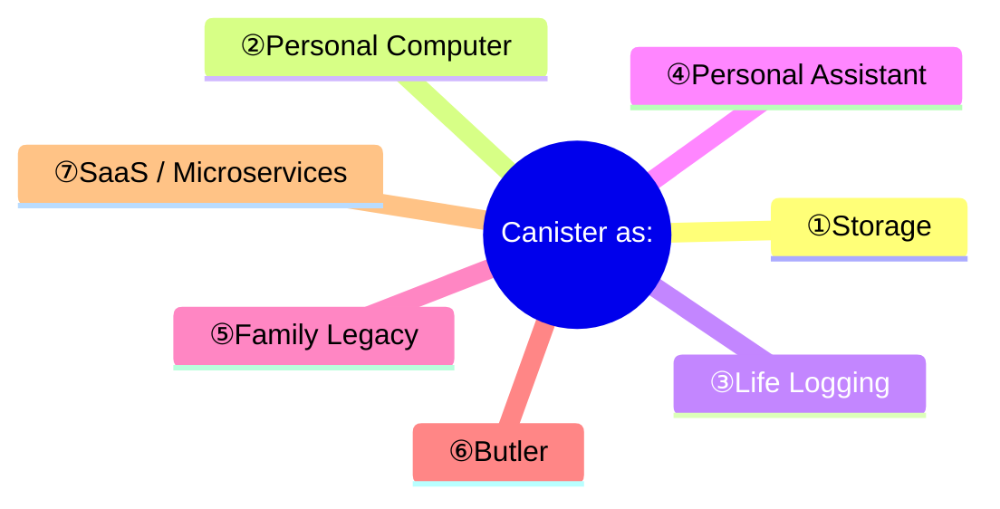
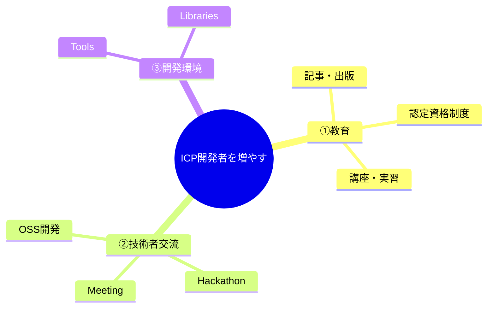

# ICP Canister Ideation

## はじめに

分散型クラウド環境であるICP (Internet Computer Protocol)上で動作するCanisterを開発して実現したいアイデアを創出する『ICP Hackathon 2025 Wave2』が2025年2月1日～2月14日（提出期限は2月10日）まで開催されています。

https://x.com/icphub_JP/status/1885341745346732452

Canisterは、プログラムとデータ（State）で構成されるSmart Contractの一種と言われています。一種という表現は、Ethereumなど従来のBlockchain上のSmart Contractよりも高度な機能を持ち、より複雑なアプリケーションやサービスを実装できる特徴があるためです。

一方、Internet Computerを分散型クラウド環境と捉えると、CanisterはServerless ComputingやPaaSの実行環境であり、特定のクラウドサービスプロバイダーには依存しないオープンなプラットフォーム上で動作するという大きな特徴があります。

## 1. アイデアの整理『Canister as～』

まずは、『Canister as ～』という視点で掘り下げてみたいと思います。  

### ①Storage

Canisterは『Storage』として利用することができます。

既存のAWS S3、Azure Storage、Google Cloud Storageとの大きな違いは、Wasmモジュールによりデータの管理方法やアクセスI/Fを任意に決定できるプログラマブルな点です。

ファイルを保存する機能だけではなく、DBのような非ファイルのデータも柔軟に取り扱えるようI/Fを追加・変更することもできます。

これから先、数十年、数百年という長期にわたってデータを記録・保管することを考えた場合、ベンダーロックインされることなく、また、データの完全性・可用性の観点で、アクセスI/Fやデータ構造などの仕様がオープンに議論されて決定していくことが重要であり、分散型のクラウドストレージは透明性が高いと考えます。

#### 既存のCloud Storageの課題

* **ベンダーロックイン**: 特定のプロバイダーのサービスに依存し、乗り換えが困難になる。
* **検閲リスク**: データが意図せず検閲される可能性がある。
* **透明性の欠如**: データの管理方法やアクセスログが公開されない。

#### Canisterによる分散型Storageの特徴

* **柔軟性**: Wasmモジュールにより、データの管理方法やアクセスI/Fを自由にカスタマイズできる。
* **検閲耐性**: 分散型アーキテクチャにより、検閲を受けにくく、データの自由な流通を促進できる。

#### 参考情報

CanisterをStorageとして利用するには、現時点では容量やコスト面で課題がありますが、これらは時間が解決する問題とも考えられます。

##### ストレージ最大サイズ

Canisterが記録できる最大のデータ容量は、2025年2月時点で500GiBです。

https://internetcomputer.org/docs/current/developer-docs/smart-contracts/maintain/storage#stable-memory

>The maximum storage limit for stable memory is 500GiB if the subnet the canister is deployed on can accommodate it.

#### ストレージコスト

https://internetcomputer.org/docs/current/developer-docs/smart-contracts/maintain/storage#storage-cost

>Storage cost is calculated based on the GiB of storage used by a canister per second, costing 127_000 cycles on a 13-node subnet and 127_000 / 13 * 34 cycles on a subnet with 34 nodes. In USD, this works out to about $0.43 and $1.13, respectively, for storing 1 GiB of data for a 30-day month. The cost is the same whether the canister is using heap memory, stable memory, or both.

### ②Personal Computer

CanisterはStorageであるという考えをさらに進めて、次に『Personal Computer』として考えてみました。

Internetが普及する以前、多くのPersonal Computerはスタンドアローンで利用され、各アプリケーションのデータはComputer内に完結していました。

しかしながら、様々なWebサービスを利用している現在では、自分のデータがWebサービス側にのみ保存されていることも多く、サービスを利用しなくなったり、サービス停止によってデータにアクセス出来なくなってしまうこが多々あります。

本来、自分が持つべきデータをWebサービス側が持っているという現状に対して、Canisterを活用することで解決できるのではないかと考えています。

Webサービスが今までローカルPCにデータを保存しなかった理由として、WebブラウザからPCに自由にアクセスできないセキュリティ上の制限や、どのデバイスからアクセスしてもサービスが利用できるようにする点が挙げられます。

Internet上に自分のComputer（Canister）を配置して適切なアクセス制御を行うことで、サービスプロバイダー側がすべての個人データを持つ必要性も減り、データの主権を取り戻せるようになると考えています。

また、PCやスマホからGoogle DriveやiCloudなどのクラウドストレージに容易にデータにアクセスしたりデータの同期が行われることと同様、様々なデバイスから自分のCanisterへデータアクセスができ、そのCanisterを通じて様々なWebサービスを利用するような仕組みに変わる可能性が考えられます。

#### Webサービスがデータを持っていることによる問題点

* **データの集中リスク**: サービスプロバイダーにデータが集中するため、情報漏洩や不正アクセスのリスクが高い。
* **ベンダーロックイン**: 特定のサービスにデータを預けることで、他のサービスへの移行が困難になる。
* **サービス終了リスク**: サービスが終了した場合、データにアクセスできなくなる可能性がある。
* **プライバシー侵害リスク**: サービスプロバイダーが勝手にユーザーデータを収集・分析し、プライバシーが侵害される可能性がある。
* **検閲リスク**: データが意図せず検閲される可能性がある。

#### ユーザごとにCanisterを持ちデータ管理するメリット

* **データオーナーシップ**: ユーザーが自身のデータを完全にコントロールできる。
* **高い可用性**: データが分散型ネットワーク上に保存されるため、単一障害点のリスクを回避できる。
* **高いセキュリティ**: データが暗号化され、分散型ネットワークによって保護されるため、セキュリティが高い。
* **相互運用性**: データが自分のCanister内に一元管理されることで、異なるサービス間でデータを共有しやすくなり、新たなサービスに利用しやすくなる
* **検閲耐性**: 自分のCanisterの外部にデータを保存する必要がなくなり検閲を受けにくい。

### ③Life Logging

私個人の経験として、子どもが生まれてからずっと成長の記録、読書や学習の記録、また、描いた絵や文章、賞状などの紙媒体はスキャンして、できるかぎりデジタルデータとして残してきました。

現時点ではまだどのような意味を持つのかの答えをはっきりとは見い出せていませんが、記録として残ってさえいれば、思い出すきっかけになますし、大人になったときに成長の記録としてデータを渡すことができます。このようなデータは、いつか何かしらの価値を生むかもしれません。

読書記録やオンライン学習サービスのレッスン記録など、様々なWebサービスを利用する中で、個人のデータとして記録を残すためには、現状、Webページからのコピー&ペーストやWebスクレイピング、WebページのPDF保存などを行う必要があります。  
Export機能を提供しているサイトもありますが、できれば、Webサービスが個人のCanisterに、公開されたデータ形式によって、逐一、自動で記録していってほしいと考えています。

また、PCやクラウド上にあるファイルは、誤った操作等によってデータが消失してしまうリスクが常にあります。データをずっと残せるようにするには、一時的に保存するだけのデータとは別に、GitやSubversion、もしくはBlockchainのように履歴が残って、改ざんを抑止・検知できる仕組みも不可欠です。

データの真贋証明も重要になってきます。賞状や資格、卒業証書など紙媒体をただスキャンしただけでは、それが本物かどうか分かりませんので、発行元が画像ファイルなどのデジタルデータに電子署名を入れる仕組みや、その署名が正しいことを容易に検証できる仕組みも必要になっていくでしょう。

### ④Personal Assistant

記録してきた個人のデータ、学習サイトその他教育コンテンツサイトを利用した記録など、様々なデータが1つのCanister内に集約され記録されることによって、効率よく個人データのAI学習が行えるようになり、Personal Assistantとしての機能も提供できる可能性があります。

様々なデータの形式や分析・学習方法など、実現にはまだまだ多くの課題があるかと思いますが、Canisterは、StorageやPersonal Computerとしての機能だけではなく、Personal Assistantとしても機能するようになると考えます。

ヒトが生まれたときにCanisterをつくって様々なデータを記録を残していき、いつか亡くなった後にも、AIがディジタルツインのようにデータを守り、生き続けることになるかもしれません。

### ⑤Family Legacy

『100年、200年後の未来にデータを遺していきたい』と考えたときに、一人1 Canisterという単位だけではなく、家族や世帯という単位でもCanisterを用意することになると考えます。

先祖代々から受け継がれてきた家宝には、長い年月を経てずっと残すことができたという点だけでも十分に価値があるように、遠い未来において、この時代を記録したデジタルデータにも価値があるでしょう。

コンピュータが誕生してデジタルデータが扱われるようになってから、まだ100年も経っていません。  
そのあいだに文字コードから、文書、画像、動画など様々なデータの標準化も進み、Internetも普及して、ようやくデータを遺せる環境が整いつつあります。

数百年後の未来にもデータを遺していくことは、企業や公的機関であれば、管理・運用が徹底していますが、個人のレベルでは、実際のところ、非常に難しいでしょう。

ローカルPCにデータを保存していた頃は、フロッピーディスク、CD、DVD、磁気テープ等にデータがバックアップされていましたが、すでにこうした記憶メディアには収まらないデータ量になっています。  
HDDやSSDは破損や被災リスクもありますから、オンラインクラウドストレージと併用しているのが一般的かと思いますので、毎月の維持コストもかかります。

30年前の文書やメールを残せている人さえ少数ですから、今後数百年に渡り、世代を越えて現在のデジタルデータをずっと遺していくことが如何に難しいか想像さえできません。

#### 家族のデータを未来に遺すことの価値

* **ルーツ・アイデンティティの確立**: 過去の家族の記録は、子孫にとって自身のルーツやアイデンティティを知る上で貴重な情報となります。先祖の生きた時代背景や文化、価値観などを知ることで、自分自身を深く理解することになります。
* **家族の歴史・物語の継承**: 家族の歴史や物語は、世代を超えて語り継がれることで、家族の絆を深める役割を果たします。過去の出来事や教訓を共有することで、家族の価値観や文化を継承し、一体感を醸成することができます。
* **家族の記録・記憶の共有**: 写真、動画、日記、手紙など、様々な形で残された家族の記録は、子孫にとってかけがえのない思い出の品となります。家族の記憶を共有することで、世代間のコミュニケーションを促進し、家族のつながりを強化することができます。
* **家族の教訓・知恵の伝承**: 過去の家族の経験や教訓は、子孫にとって人生の指針となることがあります。成功談だけでなく、失敗談や苦労話なども共有することで、子孫は人生の教訓を学び、困難を乗り越える力を得ることができます。

### ⑥Butler

個人のCanisterにPersonal Agssistantがあるように、Family Legacyを世代を越えて大切に守り続け、語り継いでいくためには、AI Butler（執事）という存在が考えられるかもしれません。

数百年後の未来、AI Butlerが、家族のストーリーを語る姿を想像してみてださい。
データがしっかり遺っていれば、そこから生み出される価値は計り知れません。

昨年、受講したBlockchain講座の個人発表で用意した資料『[未来に遺すデータ管理](/images/2024-08-07_未来に遺すデータ管理.pdf)』より

### ⑦SaaS / Microservices

Canisterを様々なサービスを提供するSaaS Platformと考えると、まったく新しいサービスを創出するアプローチだけではなく、既存のWebサービスをCanisterとして提供していくことが、Internet Computerの普及には欠かせません。

すでにInternet Computer上のCanisterとして、既存のサービスと同様の機能が提供されているものもいくつかあります。

|大分類|中分類|Webサービス例|ICP|
|:--|:--|:--|:---|
|ビジネス|プロジェクト管理|[Asana](https://asana.com/), [Trello](https://trello.com/), [Jira](https://www.atlassian.com/software/jira), [Backlog](https://nulab.com/backlog/)||
||CRM|[Salesforce](https://www.salesforce.com/), [HubSpot](https://www.hubspot.com/), [Zoho CRM](https://www.zoho.com/crm/)||
||Office Suite|[Google Workspace](https://workspace.google.com/), [Microsoft 365](https://www.office.com/), [Zoho Office Suite](https://www.zoho.com/officesuite/)||
||電子署名|[docusign](https://www.docusign.com/), [CLOUDSIGN](https://cloudsign.jp)||
||人事管理 (HCM) |[Workday](https://www.workday.com/), [SAP SuccessFactors](https://www.sap.com/products/hcm.html)||
|コミュニケーション|ビデオ会議|[Zoom](https://www.zoom.com/), [Google Meet](https://meet.google.com/), [Microsoft Teams](https://teams.microsoft.com/)||
||チャット|[Slack](https://slack.com/), [Microsoft Teams](https://teams.microsoft.com/), [Google Chat](https://chat.google.com/),[LINE](https://line.me/)|[OpenChat](https://oc.app/)|
||メール|[Gmail](https://mail.google.com/), [Outlook](http://outlook.com/), [Yahoo! Mail](http://mail.yahoo.co.jp/)||
||ストレージ/データ共有|[Google Drive](https://drive.google.com/), [OneDrive](https://onedrive.live.com/), [iCloud](https://www.icloud.com/)|[DocuTrack](https://github.com/dfinity/ic-docutrack), [uBin](https://h3cjw-syaaa-aaaam-qbbia-cai.ic0.app/)|
||ソーシャルメディア|[Facebook](https://www.facebook.com/), [X](https://x.com/), [Instagram](https://www.instagram.com/)||
|教育|オンライン学習プラットフォーム|[edX](https://www.edx.org/), [Coursera](https://www.coursera.org/), [Khan Academy](https://www.khanacademy.org/) ||
||オンラインテスト|[Kahoot!](https://kahoot.com/), [Quizlet](https://quizlet.com/)||
||読書記録|[Raz-Kids](https://www.raz-kids.com/), [Accelerated Reader](https://uk.renaissance.com/products/accelerated-reader/), [Yondemy](https://lp.yondemy.com/) ||
||語学学習|[Duolingo](https://www.duolingo.com/), [Speak](https://www.speak.com/), [DMM Eikaiwa](https://eikaiwa.dmm.com/), [Native Camp.](https://nativecamp.net/) ||
|エンターテイメント|動画配信|[Netflix](https://www.netflix.com/), [Amazon Prime Video](https://primevideo.com/), [Hulu](https://www.hulu.com/)||
||音楽配信|[Spotify](https://spotify.com/), [Apple Music](https://music.apple.com/)|[TRAX](https://trax.so/)|
||ゲームプラットフォーム|[Steam](https://store.steampowered.com/), [Epic Cames](https://epicgames.com/)|[Boom DAO](https://u52bf-3qaaa-aaaal-qb5wq-cai.icp0.io/)|
||写真共有|[Instagram](https://www.instagram.com/), [Flickr](https://www.flickr.com/), [Google Photos](https://photos.google.com/)||
||電子書籍|[Kindle](https://www.amazon.com/kindle-dbs/storefront), [Google Play Books](https://play.google.com/store/books), [Kobo](https://books.rakuten.co.jp/e-book/)||
|開発|ソースコード管理|[GitHub](https://github.com/), [GitLab](https://gitlab.com/), [Bitbucket](https://bitbucket.org/product)||
||CI/CD|[CircleCI](https://circleci.com/), [Jenkins](https://www.jenkins.io/)||
||クラウドIDE|[GitHub Codespaces](https://github.com/features/codespaces), [VS Code for the Web](https://vscode.dev/), [Deno Deploy](https://deno.com/deploy)|[Motoko Playground](https://m7sm4-2iaaa-aaaab-qabra-cai.raw.ic0.app/)|
|ユーザー管理|認証・認可|[Active Directory](https://learn.microsoft.com/ja-jp/troubleshoot/windows-server/active-directory/active-directory-overview), [Open LDAP](https://www.openldap.org/), [OAuth](https://oauth.net/2/), [OpenID](https://openid.net/)|[Internet Identity](https://identity.ic0.app/)|
|ツール|パスワード管理|[1Password](https://1password.com/), [Bitwarden](https://bitwarden.com/)||

### 既存サービスとの差別化

同様のサービスをInternet Computer上に展開しただけでは、ユーザーにとって既存サービスから乗り換える大きなメリットはないかもしれません。

既存サービスとの差別化として、これまで整理してきた①～⑦のアイデアを取り込み、サービスプロバイダー側が個人のデータを所有するのではなく、個人のCanisterと連携し、個人のデータ主権が確保されるような仕組みに変えることはメリットになると考えています。

サービスプロバイダー側にとっては全てのユーザのデータを管理するコストの負担はなくなり、利用するユーザーは自分のCanister内にデータを所有することができます。

ユーザーにはCanisterの維持コストがかかりますが、一般的なクラウドストレージサービスを利用する場合の費用と考えられます。

個人のデータ主権を取り戻し、データが勝手に取集され利用されるのを防ぐとともに、サービスプロバイダーとの同意の下、データの一部利用を条件に、ストレージコストを負担してもらう（データ利用の対価を受け取る）といった仕組みも、Micropaymentによって実現可能でしょう。

## 2. アイデアの整理『ICPの普及』

ICPを普及させていくには、まずはICPの開発者を増やして、様々なサービスが開発され利用できるプラットフォームにする必要があります。

ICP開発者をどのように増やしていくかというアイデアについて整理してみます。

### ①教育

世の中には優秀なエンジニアの方々がたくさんいて、さまざまな開発プロジェクトで活躍されています。

こうしたプロジェクトにおける技術選定では、性能要件を満たしているか、運用実績や十分なノウハウが蓄積されているかなど、エンジニアの視点が重要で、彼らがそもそもICPにリーチできていないと採用されることはありません。

#### 記事・出版

まずはBlogや、Qiita、Zennなどの技術情報サイトにICPに関する有益な情報が増えていく必要があります。現状は簡単なサンプルを動かしてみよう的な記事がほとんどですが、実際にサービスを開発・運用して得られた知見等が増えてくれば、採用されやすくなるでしょう。また、認知度が高まっていけば、体系的に学べる書籍のニーズも出てくるかもしれません。

#### ICP認定資格

認定資格制度の存在は、枯れた技術（熟成された技術）にしていくために重要なプロセスと考えています。

[AWS認定資格](https://aws.amazon.com/jp/certification/)が好例と考えます。  
AWSサービスが開始された2006年頃、Cloud Computingに懐疑的な見方をしていた方も多かったにも関わらず現在では幅広く利用されているように、分散クラウドのICPも将来的に普及する可能性は大いにあります。

これに向けて認定資格制度をつくり、レベルに応じて無償のものから有償のオンライン認定試験を行い、認定証を発行する（NFT?）、また体系的に学べるよう講座やトレーニング開催するという教育環境を整えていくことが、昔ながらの古臭いやり方ではありますが有効と考えます。

### ②技術者交流

意見交換しやすいオンライン上のコミュニティスペースや、オフラインでのイベント開催は交流のきっかけになります。今回の開催されたHackerthonでも、参加された方がどのようなことに関心があり、どんなサービスをつくりたいのかを知るよい機会と思いました。

### ③開発環境

開発支援ツールやライブラリは普及のためには欠かせません。ICPの開発ケースが増えていけば、充実していくでしょう。たとえ小さいサービスでも、実際につくってみてノウハウを蓄積していくことが大切です。

### 3. サービスのアイデア

これまで整理してきたアイデアをベースに、Internet Computer上の具体的なサービスのアイデアを挙げてみます。

アイデアの細かい内容まで掘り下げる余力がありませんでしたが、個人のデータをサービスプロバイダー側が所有するのではなく、自分のCanister内にオープンな仕様で保存され、様々なサービスで利用できるようになることにより、可能性が広がると考えています。

|カテゴリー | サービス名 (暫定) | 概要 |
|:-----|:----|:----|
|ストレージ| Personal Canister |個人用の分散型ストレージ (1 Canister/人) |
|      | Family Canister | 世代を越えて家族の記録を遺していくためのストレージ|
|育児・教育  |成長記録 |子どもの身長・体重の変化、いつ寝返りをしたかをはじめ成長のイベントや思い出などの記録|
||育児記録の共有サービス|育児記録（いつ頃どんなことを学び、何の本を読んだか、どんな習い事をしたか、どういう結果につながったか）を、プライバシーを守りながら共有（売買）できるサービス|
||絵本|AIを使って絵本を読み聞かせるサービス また、有名な絵本だけではなく、家族にまつわる昔話など、蓄積された記録を元に絵本をつくるサービス|
||読書記録|いつ何の本を読んだか、あらすじや感想の記録、AIによる理解度テストが行えるサービス|
|コミュニケーション|チャット支援|チャットの記録から相手の思惑を分析したり、返事を提案してくれるサービス|
||オレオレ検定|自分のことを相手がどのくらい知っているかの検定試験を通じて、相手に認定証を発行できるサービス。 認定証のレベルに応じてSNSなどのフィルタリング設定に利用（できるようになってほしい）|
|ツール|電子署名|個人がデジタルデータに簡単に電子署名できる仕組みの提供|
|ICP普及|ICP認定資格|ICP認定資格のオンライン試験サービス|
||Canister Directory Service|Webポータルサイトのように、Canisterの様々なサービスを利用しやすくしたり、検索できる日本語のサービス|
||Canister費用支払い代行 |ICPトークンやCycleを持っていないユーザーでもCanisterを維持できるよう日本円でtop-upできるサービス|
